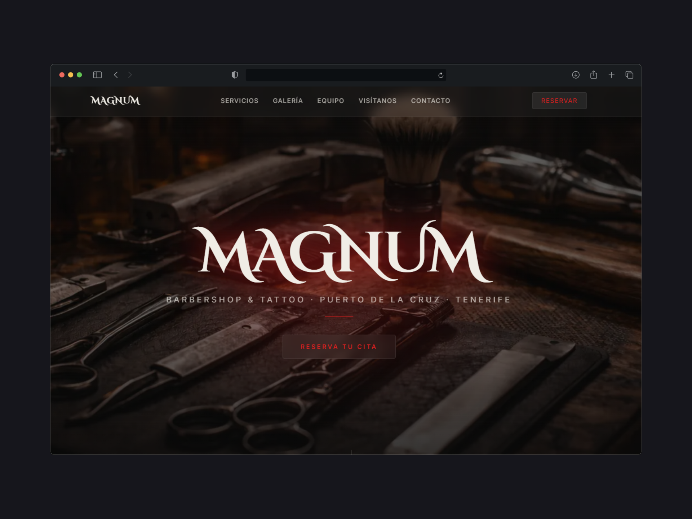

# Magnum Barbershop & Tattoo

> Sitio web oficial de **Magnum Barbershop & Tattoo**, una barbería ubicada en Puerto de la Cruz, Tenerife, que además ofrece servicios de tatuaje. La web presenta al equipo, muestra la galería de trabajos, permite realizar reservas y facilita el contacto con el local.

---

## Demo

[Ver demo en vivo](https://www.magnum-barbershop.es/)

---

## Captura de pantalla



---

## Sobre el proyecto

**Magnum Barbershop & Tattoo** es un negocio especializado en cortes de pelo y tatuajes con sede en Puerto de la Cruz, Tenerife. Su sitio web refleja la estética oscura y profesional del local, permitiendo a los clientes conocer los servicios disponibles, descubrir el trabajo del equipo a través de una galería visual, hacer reservas online y encontrar la ubicación del negocio.

### Características principales

- Diseño oscuro y moderno acorde a la identidad de la marca
- Galería de cortes y tatuajes realizados por el equipo
- Sección de reservas integrada
- Presentación del equipo con fotos y especialidades
- Mapa de ubicación y datos de contacto

---

## Tecnologías

| Tecnología                                                                           | Versión |
| :----------------------------------------------------------------------------------- | :------ |
| [Astro](https://astro.build)                                                         | ^6.1.5  |
| [Tailwind CSS](https://tailwindcss.com)                                              | ^3.4.19 |
| [@astrojs/tailwind](https://docs.astro.build/en/guides/integrations-guide/tailwind/) | ^5.1.5  |
| [@lucide/astro](https://lucide.dev)                                                  | ^1.8.0  |

---

## Estructura del proyecto

```
Magnum-Barbershop/
├── public/                        # Recursos estáticos (imágenes, favicon)
│   ├── Miniatura-magnum.png       # Captura de pantalla del sitio
│   ├── Magnum-Fondo.webp          # Imagen de fondo principal
│   ├── Filip.jpeg                 # Foto del equipo
│   ├── Ale.jpeg
│   ├── Cris.jpeg
│   ├── Corte-*.png                # Fotos de cortes de pelo
│   ├── mano-*.jpeg                # Fotos de tatuajes
│   ├── pecho.jpeg
│   └── favicon.svg / favicon.ico
├── src/
│   ├── components/                # Componentes reutilizables
│   │   ├── Navbar.astro
│   │   ├── Hero.astro
│   │   ├── Servicios.astro
│   │   ├── Galeria.astro
│   │   ├── Equipo.astro
│   │   ├── Reserva.astro
│   │   ├── Ubicacion.astro
│   │   └── Contacto.astro
│   ├── layouts/
│   │   └── Layout.astro           # Layout base de la aplicación
│   └── pages/
│       └── index.astro            # Página principal
├── astro.config.mjs
├── tailwind.config.cjs
├── tsconfig.json
└── package.json
```

---

## Componentes

| Componente        | Descripción                                                                     |
| :---------------- | :------------------------------------------------------------------------------ |
| `Navbar.astro`    | Barra de navegación con enlaces a todas las secciones                           |
| `Hero.astro`      | Sección de portada con imagen de fondo, título y botón de reserva               |
| `Servicios.astro` | Lista de servicios ofrecidos: cortes, arreglo de barba, tatuajes, etc.          |
| `Galeria.astro`   | Galería visual de trabajos realizados (cortes y tatuajes)                       |
| `Equipo.astro`    | Presentación del equipo con foto y descripción de cada miembro                  |
| `Reserva.astro`   | Formulario o enlace para realizar una reserva online                            |
| `Ubicacion.astro` | Mapa e información de la localización del local en Puerto de la Cruz            |
| `Contacto.astro`  | Datos de contacto: teléfono, email y redes sociales                             |
| `Layout.astro`    | Layout base que envuelve todas las páginas con head, fuentes y estilos globales |

---

## Instalación y uso

### Requisitos

- Node.js `>=22.12.0`
- pnpm

### Comandos

| Comando          | Acción                                               |
| :--------------- | :--------------------------------------------------- |
| `pnpm install`   | Instala las dependencias                             |
| `pnpm dev`       | Inicia el servidor de desarrollo en `localhost:4321` |
| `pnpm build`     | Genera el sitio de producción en `./dist/`           |
| `pnpm preview`   | Previsualiza el build localmente antes de desplegar  |
| `pnpm astro ...` | Ejecuta comandos de la CLI de Astro                  |
